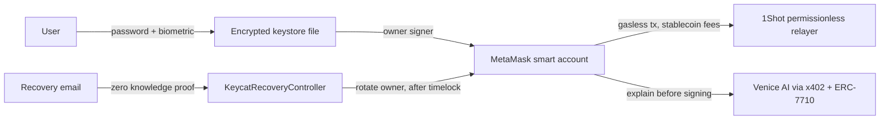

# Keycat

**The wallet you can't lose.** A non custodial smart wallet that lives in one encrypted file and comes back with just your email.

[Launch app](https://keycat.net/app) · [Docs](https://keycat.net/docs) 

---

## What it is

Keycat is a self custody wallet built on a single encrypted keystore file. The user holds the file, protected by a password and an optional device biometric. Every wallet is a MetaMask smart account whose owner signer is the keystore key, which makes transactions gasless and makes the key rotatable. If the file is ever lost, the user recovers the wallet with nothing but their email, verified entirely on chain by a zero knowledge proof.

It ships two ways: a one script embeddable widget for any dApp, and a full standalone wallet at `/app` so users get the complete experience even with no integration.

## The core invariant: zero backend

Keycat runs no server, no database, and no API keys. Anywhere. Everything that needs trust is either client side or on chain. This is not a detail, it is the product. It means a whole class of failures, custody, key theft from a server, user profiling, simply cannot happen on our side. Gas and AI inference, the two things a wallet usually needs a backend for, are consumed through permissionless, pay per use channels instead.

## How it works



## Built on

| Technology | Role in Keycat |
|---|---|
| MetaMask Smart Accounts Kit | Every wallet is a Hybrid smart account; the keystore key is the owner signer. EIP-7702 upgrade path, ERC-7710 delegations, owner rotation for recovery. |
| 1Shot Permissionless Relayer | Gasless 7702 upgrades and 7710 executions with stablecoin fees, recovery relayed for users with no ETH, webhooks as status source. |
| Venice AI | Plain language transaction review before signing, paid per use over x402. |
| ZK Email | Audited on chain email recovery. The only contract we authored is a thin adapter over it. |

## Repo structure

```
packages/keystore     Argon2id + AES-256-GCM keystore, WebAuthn PRF factor, pure browser crypto
packages/wallet-ui    All wallet flows and hooks, shared by the widget and /app
packages/sdk          One script embed, EIP-1193 provider + EIP-6963 discovery
packages/shared       Chain config, deployed addresses, token list
contracts             KeycatRecoveryController (Foundry)
apps/web              Next.js: / landing, /app wallet, /widget iframe, /docs
apps/demo-dapp        KittySwap, a third party dApp that embeds Keycat
```

## Getting started

Requires Node 20+ and pnpm. This is a pnpm workspace, so use pnpm, not npm.

```bash
pnpm install

pnpm --filter ./apps/web dev        # landing, /app, /docs
pnpm --filter ./apps/demo-dapp dev  # KittySwap demo dApp

pnpm -r build
pnpm -r test
forge test --root contracts
```

Copy `.env.example` and fill it in. No environment variable holds a Keycat owned secret, by design.

### Deploy the recovery controller

```bash
export DEPLOYER_PRIVATE_KEY=0x...    # funded on Base Sepolia
export BASE_SEPOLIA_RPC_URL=https://...
forge script contracts/script/DeployKeycatRecoveryController.s.sol \
  --rpc-url $BASE_SEPOLIA_RPC_URL --broadcast
```

Then put the deployed address into `packages/shared/src/deployments.ts` and set `NEXT_PUBLIC_RECOVERY_CONTROLLER_ADDRESS`.

## The keystore

A single self describing JSON file. The private key is sealed with AES-256-GCM, and the key that unseals it is derived from the password with Argon2id, with the WebAuthn PRF output folded in when the device factor is enabled. A wrong password, a wrong device, or a tampered file all fail the same way, with no hint about which. The file carries everything needed to decrypt it and nothing that identifies the user. Full spec in `/docs`.

## Security and honesty

Keycat holds nothing and can neither move nor freeze a user's funds. Recovery is gated by the user's email and an on chain timelock that the real owner can cancel. If a user loses both their file and their email, the wallet is unrecoverable, and we say so plainly rather than keep a backdoor that would also serve an attacker.

What is real on testnet versus what uses a documented stand in is tracked honestly in [`BLOCKERS.md`](./BLOCKERS.md). Responsible disclosure is welcome at security@keycat.net. The recovery controller and keystore library are the surfaces we put through audit before any release that holds real funds.

---

## Smart Accounts Kit Usage

Every Keycat wallet is a MetaMask Hybrid smart account with the keystore key as the owner signer. We use ERC-7710 delegations for gasless transactions and for the AI review payment. We do not use ERC-7715 Advanced Permissions or redelegation.

### Advanced Permissions
Not used. Keycat uses ERC-7710 delegations (below).

### Delegations
- Create and sign the gasless delegation (`createDelegation` + `signDelegation`): https://github.com/farbodghasemlu/keycat/blob/077c0734a584422e9061ce5792b97e249db2dd73/packages/wallet-ui/src/signer.ts#L607-L623
- Gasless delegation scope and caveats builder (`buildGaslessDelegationConfig`): https://github.com/farbodghasemlu/keycat/blob/077c0734a584422e9061ce5792b97e249db2dd73/packages/wallet-ui/src/signer.ts#L774-L829
- Create and sign the AI review delegation (`createSignedAiReviewDelegation`): https://github.com/farbodghasemlu/keycat/blob/077c0734a584422e9061ce5792b97e249db2dd73/packages/wallet-ui/src/ai-review.ts#L272-L306
- AI review delegation scope builder (`buildAiReviewDelegationConfig`): https://github.com/farbodghasemlu/keycat/blob/077c0734a584422e9061ce5792b97e249db2dd73/packages/wallet-ui/src/ai-review.ts#L237-L271
- Redeem the delegation through the 1Shot relayer (`estimate7710Transaction` + `send7710Transaction`, passing the signed delegation as `permissionContext`): https://github.com/farbodghasemlu/keycat/blob/077c0734a584422e9061ce5792b97e249db2dd73/packages/wallet-ui/src/signer.ts#L558-L589

### Redelegation
Not used.

### x402
- Server: Not used. Keycat is the x402 client against the Venice x402 endpoint (the seller).
- Client, x402 + ERC-7710 asset transfer (`x402Erc7710Client`, `createx402DelegationProvider`): https://github.com/farbodghasemlu/keycat/blob/077c0734a584422e9061ce5792b97e249db2dd73/packages/wallet-ui/src/ai-review.ts#L452-L512
- x402 402-challenge probe that derives the approved payment scope (`probeAiReviewScope`): https://github.com/farbodghasemlu/keycat/blob/077c0734a584422e9061ce5792b97e249db2dd73/packages/wallet-ui/src/ai-review.ts#L179-L222

## 1Shot API Usage

We use the 1Shot permissionless relayer for gasless ERC-7710 executions, the EIP-7702 upgrade, and the recovery transaction.

- 1Shot relayer client (`relayer_estimate7710Transaction`, `relayer_send7710Transaction`, `relayer_sendTransaction`, `relayer_getStatus`): https://github.com/farbodghasemlu/keycat/blob/077c0734a584422e9061ce5792b97e249db2dd73/packages/wallet-ui/src/oneshot.ts#L150-L211
- Gasless ERC-7710 execution relayed via 1Shot: https://github.com/farbodghasemlu/keycat/blob/077c0734a584422e9061ce5792b97e249db2dd73/packages/wallet-ui/src/signer.ts#L569-L589
- EIP-7702 upgrade relayed via 1Shot (`relay7702Authorization`, `signAuthorization` + `relayer.sendTransaction`): https://github.com/farbodghasemlu/keycat/blob/077c0734a584422e9061ce5792b97e249db2dd73/packages/wallet-ui/src/signer.ts#L831-L918
- EIP-7702 upgrade entry point (`createUpgraded7702Signer`): https://github.com/farbodghasemlu/keycat/blob/077c0734a584422e9061ce5792b97e249db2dd73/packages/wallet-ui/src/signer.ts#L734-L761
- Recovery transaction relayed via 1Shot (`relayOrSendDustFallback`): https://github.com/farbodghasemlu/keycat/blob/077c0734a584422e9061ce5792b97e249db2dd73/packages/wallet-ui/src/recovery.ts#L317-L341
- Recovery callers (`submitRecoveryExecution`, `submitMockRecoveryRequest`): https://github.com/farbodghasemlu/keycat/blob/077c0734a584422e9061ce5792b97e249db2dd73/packages/wallet-ui/src/recovery.ts#L219-L296

## Venice AI Usage

Venice provides the plain-language transaction review shown before signing.

- Venice review request, SIWE prepaid with x402 fallback (`requestVeniceAiReview`): https://github.com/farbodghasemlu/keycat/blob/077c0734a584422e9061ce5792b97e249db2dd73/packages/wallet-ui/src/ai-review.ts#L307-L375
- Venice chat/completions call (`postJsonWithVeniceSiwe`): https://github.com/farbodghasemlu/keycat/blob/077c0734a584422e9061ce5792b97e249db2dd73/packages/wallet-ui/src/ai-review.ts#L376-L416
- Prompt, risk JSON schema, and model (`KEYCAT_AI_REVIEW_SYSTEM_PROMPT`, `KEYCAT_AI_REVIEW_MODEL`): https://github.com/farbodghasemlu/keycat/blob/077c0734a584422e9061ce5792b97e249db2dd73/packages/wallet-ui/src/ai-review-prompt.ts#L1-L11
- Parse the model response into risk objects (`parseVeniceReviewResponse`): https://github.com/farbodghasemlu/keycat/blob/077c0734a584422e9061ce5792b97e249db2dd73/packages/wallet-ui/src/ai-review.ts#L513-L536
- Review toggle wired in the controller (`prepareAiReviewScope`, `setAiReviewMode`): https://github.com/farbodghasemlu/keycat/blob/077c0734a584422e9061ce5792b97e249db2dd73/packages/wallet-ui/src/controller.ts#L272-L300

## Feedback

Our developer feedback on building with the Smart Accounts Kit, 1Shot, and Venice is in [FEEDBACK.md](./FEEDBACK.md).
